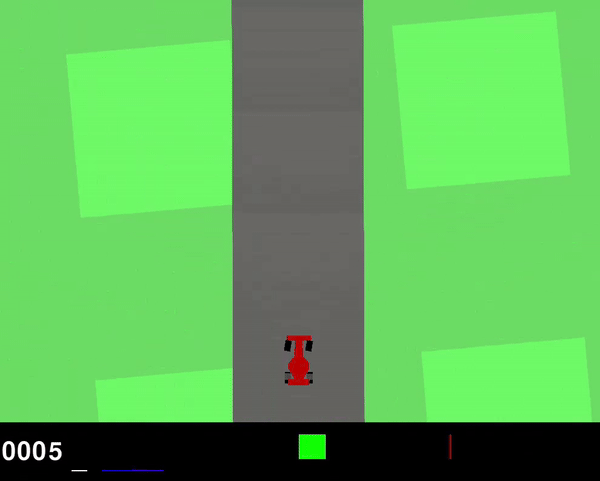

# CarRacing-ML
Machine learning and reinforcement learning project to control a car in the CarRacing-v2 game environment.

## Machine Learning

## Reinforcement Learning

Control of the car via Reinforcement learning was achieved based on the PPO algorithm. The related research paper is available in the folder .

Run inside the repository:

    python main.py [options]

        usage: main.py [-t] [-e] [--render]

        optional arguments:
          -t, --train         Train the model
          -e, --evaluate      Evaluate the model
          --render            Enable rendering

### Commands examples:

To train a new model:
```
python run.py --train
```
In each episode of the training phase, the model with the best score is saved under the name 'modelPPO.pt'.

To try out the model with environment display:
```
python main.py --evaluate --render
``` 


_Training after 1000 episodes_
